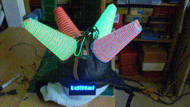
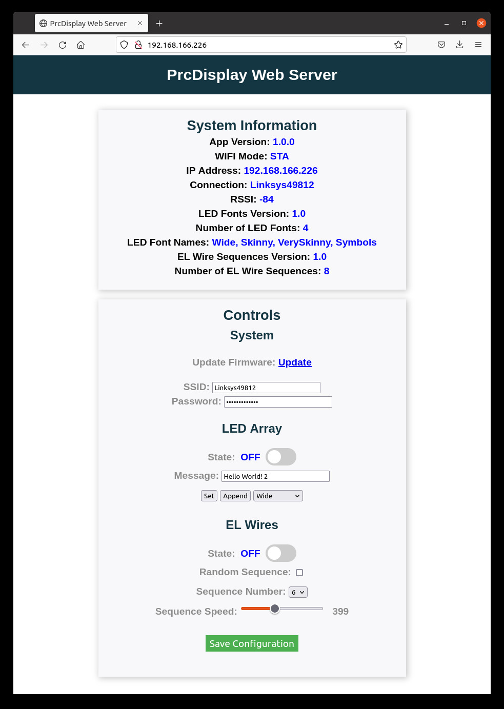
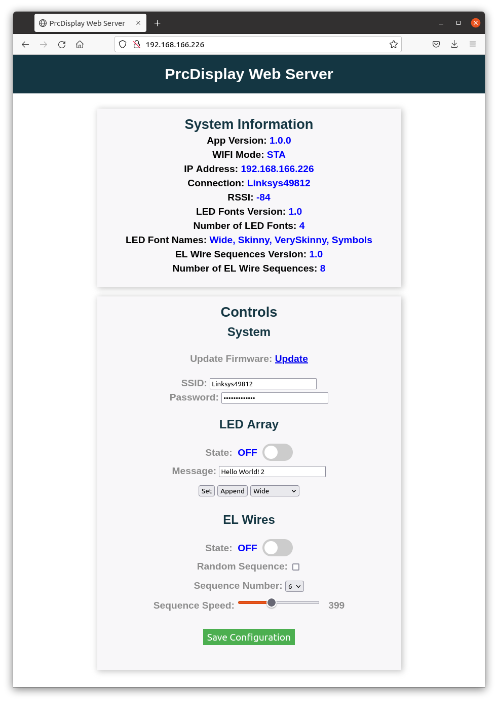

# PrcDisplay
Mark2 Tin-Foil hat

A version of the LdgDisplay for my friend Peter Christy.

## Features

* Independently controllable LED sign-board and cones wrapped with EL wires
  - LED Sign-Board
    * 21x7 array of blue LEDs
    * Multiple built-in fonts, including symbols
    * Continually scrolls (arbitrarily long) strings
    * Individual strings can be composed of characters from different fonts
  - EL Wire Cones
    * four cones, each with two independent (different colored) EL wires
    * selectable pattern and speed
* Persistent storage of configuration parameters
  - i.e., WiFi settings, LED display string, and EL cone pattern and speed
* Powered by (micro-USB) rechargable (LiPo) battery
* Standalone web-server-based status/control interface

## Web Interface

gif
jpg
png

?

## Notes

* Use 21x7 LED array from old badge as message board
  - controlled by four 74HC595
* Use Alien Font Display driver board to drive EL wires
  - controlled via I2C
* Use ESP8266 to control LED array and EL wires
  - on power-up/periodically, look for a well-known SSID/passwd (WEP?)
  - connect and serve web page with controls

## LED Array

* 21 columns, 7 rows
* Driven by four 74HC595 8-bit shift registers
* Use ShiftRegister74HC595 library for driving the shift registers
  - #include <ShiftRegister74HC595.h>
  - uint8_t pinValues[NUM_SR];
  - ShiftRegister74HC595<NUM_SR> sr(DATA_PIN, SRCLK_PIN, RCLK_PIN);
  - sr.setAll(pinValues[i]);
* columns are active low and rows are active high
* layout: assume pixel at location (0,0) is in the upper right corner
  - srValues[3]: first eight columns
    * [7:0]: columns[7:0]
      - active low
  - srValues[2]: middle seven columns
    * [6:0]: columns[15:9]
      - active low
  - srValues[1]: top three rows and last five columns
    * [7:5]: rows[2:0]
      - active high
    * [4:0]: columns[20:16]
      - active low
  - srValues[0]: bottom four rows
    * [3:0]: rows[6:3]
      - active high
* layout: [nc[3:0], rows[6:3]], [rows[2:0], cols[20:16]], [cols[15:8]], [cols[7:0]]

## TODO

* web app
  - on/off
  - battery level

